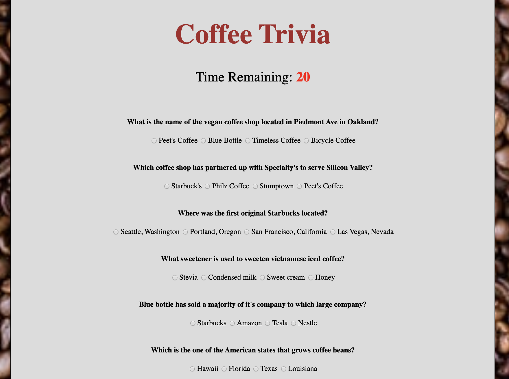
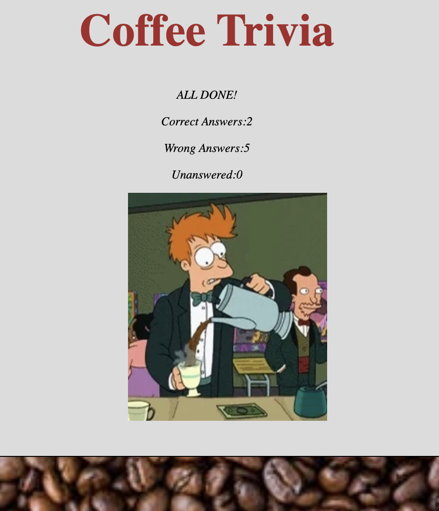

# TriviaGame

<h3><strong> Instructions </strong></h3>
 
Once the user clicks start. User will have 30 seconds to answer seven questions related to coffee since the theme of this specific trivia game is coffee. Once submit or when the time runs out, the score will be displayed to the user. The points will be tallied up as correct, incorrect or unanswered. 

Shown below is a glimpse of the trivia board. 

Shown below is a snapshot of what the score board display looks like. 

Used html, css, javascript, JQuery and recently just changed it from ES5 to ES6.

Link to the app: https://dyuen510.github.io/TriviaGame/